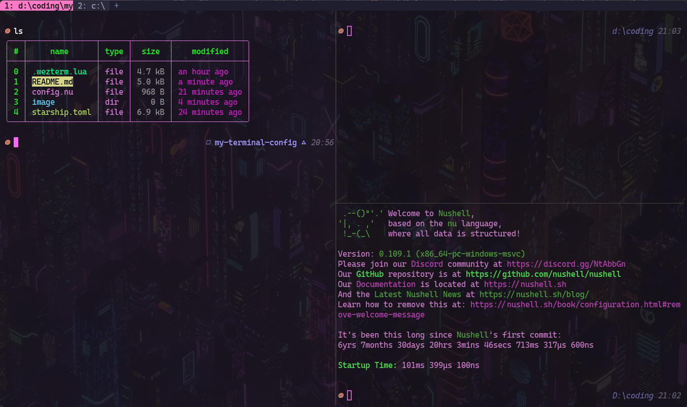

# terminal config

---

## 效果展示



## wezterm

```lua
-- 加载 wezterm API 和获取 config 对象
local wezterm = require 'wezterm'
local config = wezterm.config_builder()

config.launch_menu = {
  {
    label = 'PoserShell',
    args = { 'powershell.exe', '-NoLogo' },
  },
  {
    label = "Cmd",
    args = { 'cmd.exe'}
  }
}

-------------------- 颜色配置 --------------------
config.color_scheme = 'Sakura'
config.window_decorations = "RESIZE"
config.use_fancy_tab_bar = false
config.enable_tab_bar = true
config.show_tab_index_in_tab_bar = true
config.hide_tab_bar_if_only_one_tab = false

config.inactive_pane_hsb = {
  saturation = 0.9,
  brightness = 0.8,
}

-- 设置字体和窗口大小
config.font = wezterm.font("Caskaydia Cove")
config.font_size = 12
config.initial_cols = 140
config.initial_rows = 30

-- 设置默认的启动shell

config.default_prog = { 'C:\\Users\\锅\\AppData\\Local\\Programs\\nu\\bin\\nu.exe' }
-------------------- 键盘绑定 --------------------
local act = wezterm.action

config.leader = { key = 'a', mods = 'CTRL', timeout_milliseconds = 1000 }
config.keys = {
  { key = 'a', mods = 'LEADER', action = act.QuitApplication },

  { key = 'H', mods = 'CTRL', action = act.SplitHorizontal { domain = 'CurrentPaneDomain'} },
  { key = 'V', mods = 'CTRL', action = act.SplitVertical { domain = 'CurrentPaneDomain'} },
  { key = 'q', mods = 'CTRL', action = act.CloseCurrentPane { confirm = false} },

  { key = 'LeftArrow', mods = 'SHIFT|CTRL', action = act.ActivatePaneDirection 'Left' },
  { key = 'RightArrow', mods = 'SHIFT|CTRL', action = act.ActivatePaneDirection 'Right' },
  { key = 'UpArrow', mods = 'SHIFT|CTRL', action = act.ActivatePaneDirection 'Up' },
  { key = 'DownArrow', mods = 'SHIFT|CTRL', action = act.ActivatePaneDirection 'Down' },

  -- CTRL + T 创建默认的Tab
  { key = 't', mods = 'CTRL', action = act.SpawnTab 'DefaultDomain' },
  -- CTRL + W 关闭当前Tab
  { key = 'w', mods = 'CTRL', action = act.CloseCurrentTab { confirm = false } },

    -- paste from the clipboard
  { key = 'v', mods = 'CTRL', action = act.PasteFrom 'Clipboard' },

  -- paste from the primary selection
  { key = 'v', mods = 'CTRL', action = act.PasteFrom 'PrimarySelection' },
}

for i = 1, 8 do
  -- CTRL + number to activate that tab
  table.insert(config.keys, {
    key = tostring(i),
    mods = 'CTRL',
    action = act.ActivateTab(i - 1),
  })
end

-------------------- 鼠标绑定 --------------------
config.mouse_bindings = {
  -- copy the selection
  {
    event = { Up = { streak = 1, button = 'Left' } },
    mods = 'NONE',
    action = act.CompleteSelection 'ClipboardAndPrimarySelection',
  },

  -- paste the selection
  {
    event = { Up = { streak = 1, button = 'Right' } },
    mods = 'NONE',
    action = act.PasteFrom 'Clipboard',
  },

  {
    event = { Up = { streak = 1, button = 'Right' } },
    mods = 'NONE',
    action = act.PasteFrom 'PrimarySelection',
  },

  -- Open HyperLink
  {
    event = { Up = { streak = 1, button = 'Left' } },
    mods = 'CTRL',
    action = act.OpenLinkAtMouseCursor,
  },
}

-------------------- 窗口居中 --------------------
wezterm.on("gui-startup", function(cmd)
        local screen = wezterm.gui.screens().active
        local width, height = screen.width * 0.5, screen.height * 0.5
        local tab, pane, window = wezterm.mux.spawn_window(cmd or {
                position = {
            x = (screen.width - width) / 2,
            y = (screen.height - height) / 2,
            origin = {Named=screen.name}
        }
        })
        window:gui_window():set_inner_size(width, height)
end)

-- 设置窗口透明度
config.window_background_opacity = 0.9

-- 自定义 Tab Bar 颜色
config.colors = {
  tab_bar = {
    -- Tab Bar 背景色
    background = '#1e1e2e',

    -- 当前激活的 Tab
    active_tab = {
      bg_color = '#ff79c6',
      fg_color = '#1a1a1a',
      intensity = 'Bold',
    },

    -- 非激活的 Tab
    inactive_tab = {
      bg_color = '#2a2a3c',
      fg_color = '#a0a0b0',
    },

    -- 鼠标悬停时的非激活 Tab
    inactive_tab_hover = {
      bg_color = '#45475a',
      fg_color = '#f5c2e7',
    },

    -- 新建 Tab 按钮
    new_tab = {
      bg_color = '#1e1e2e',
      fg_color = '#6272a4',
    },

    -- 新建 Tab 按钮悬停
    new_tab_hover = {
      bg_color = '#ff79c6',
      fg_color = '#1a1a1a',
    },
  },
}

return config
```

## nushell

```
# 初始化 starship
mkdir ($nu.data-dir | path join "vendor/autoload")
starship init nu | save -f ($nu.data-dir | path join "vendor/autoload/starship.nu")

# 解决输入字符终端文字上移的问题
$env.config.shell_integration.osc133 = false
# 适配需要支持右提示词的主题
$env.config.render_right_prompt_on_last_line = true
```

## starship

https://starship.rs/zh-CN/presets/jetpack
